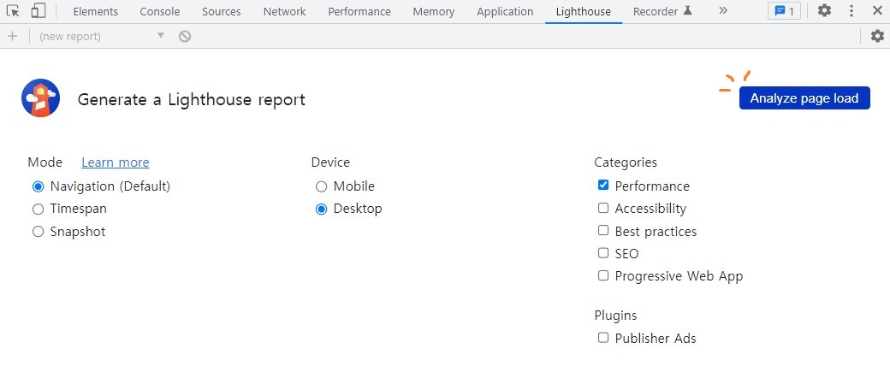
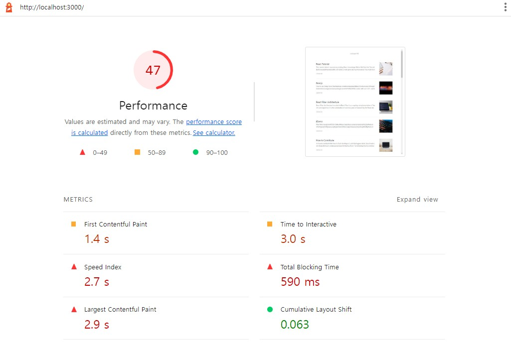
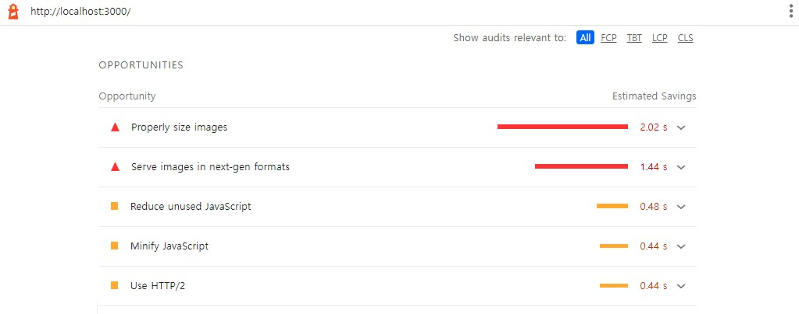
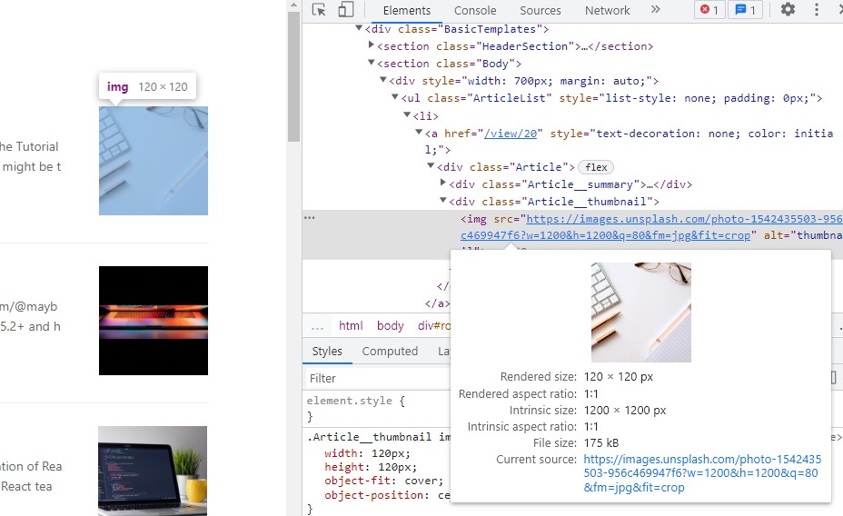
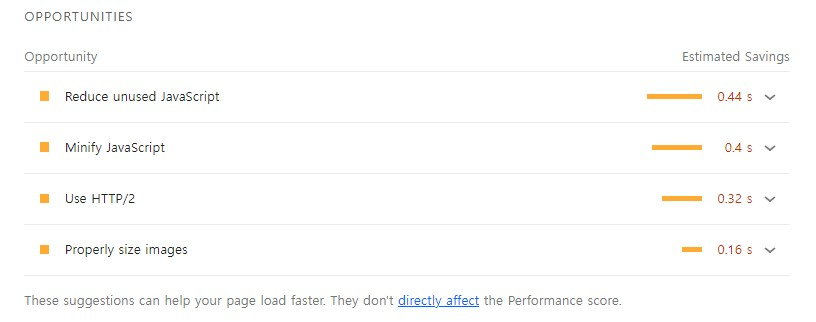
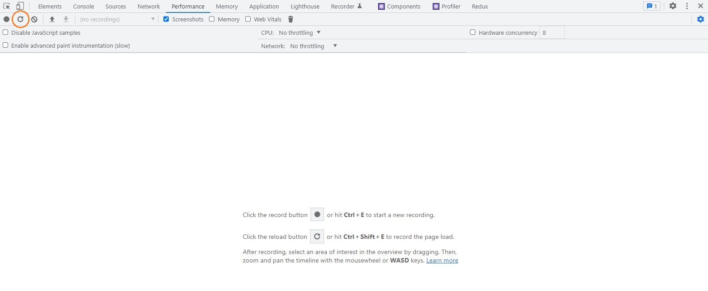
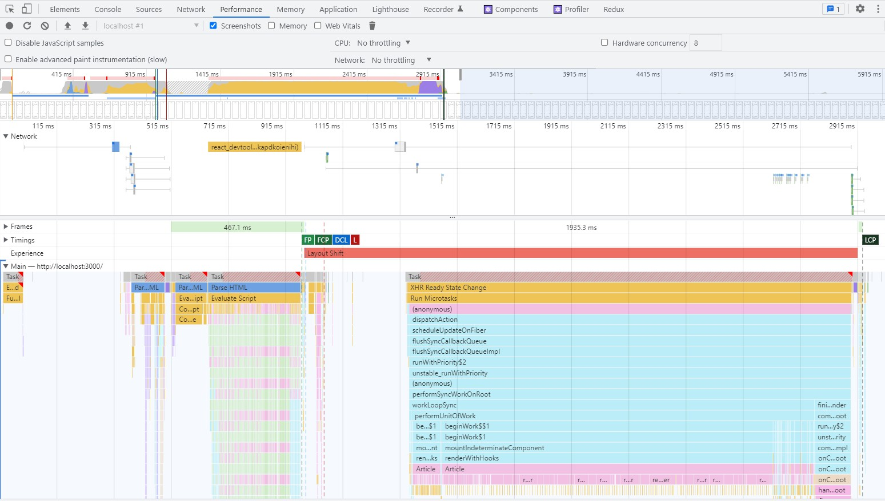
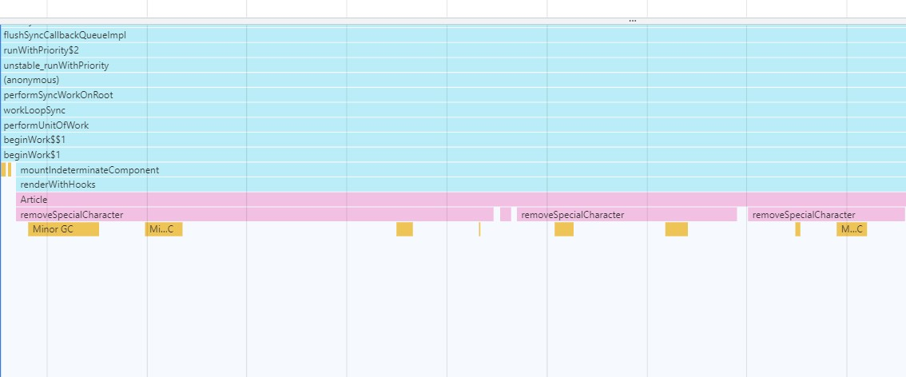
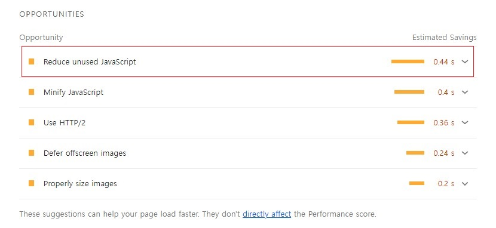

# 웹 성능 최적화 실습 1

정적 블로그 웹 페이지를 최적화하는 실습입니다.

강의를 보면서 알게된 내용에 대해서 정리했으며, 생략한 내용도 있습니다.

## 실습 내용

1. 로딩 성능 최적화

  - 이미지 사이즈 최적화
  - Code split
  - 텍스트 압축

2. 렌더링 성능 최적화

  - Bottleneck 코드 최적화

## 사용 툴

- Performance 패널을 이용한 분석
- Lighthouse 패널을 이용한 분석
  - OPPORTUNITIES : 로딩 성능에 대한 설명
  - DIAGNOSTICS: 렌더링 성능에 대한 설명

## 성능 최적화 실습 시작!

[소스코드](https://github.com/performance-lecture/lecture-1)에서 소스를 clone한다.

해당 폴더 경로에서 터미널을 열고, npm i 명령어를 통해 노드 모듈들을 다운받는다.

노드 모듈 다운로드가 완료되면, 아래 명령어로 react app과 server를 실행시킨다. (따로 입력해야함)

```
> React app 실행
$ npm start 
> Server 실행
$ npm run server
```

## 문제 찾기 (1)

현재 실행된 웹 서비스의 상태를 진단하기 위해서, F12를 눌러 개발자 도구를 연다.

그리고 Lighthouse 탭을 누르면, 아래 사진과 같은 화면이 나온다.



왼쪽 상단에 있는 Analyze page load를 누르면 진단이 시작된다.

진단을 다 하고나면 아래 화면과 같이 나오는데, 현재 웹 서비스의 성능 점수는 47점이다.



아래로 내려보면 어떤 문제점을 개선해야 하는지 알려주는데, **OPPORTUNITIES**은 **로딩 성능**에 대한 설명이고 **DIAGNOSTICS**은 **렌더링 성능**에 대한 설명이다.

먼저 OPPORTUNITIES을 보면, 가장 문제가 심각해보이는 항목은 Properly size images이다. 즉 이미지 크기를 조정하라는 의미이다.



그렇다면, 이미지 사이즈 최적화부터 해보자!

### 이미지 사이즈 최적화

이미지 사이즈는 HTML 요소를 선택해서 확인해볼 수 있다. 



확인해보니, 화면에서 보이는 이미지는 '120px X 120px'밖에 안되는데 이미지 원본 사이즈는 '1200px X 1200px'이나 된다.

프론트엔드에서 이미지 사이즈를 최적화할 수 있는 방법이라기 보다는, 서버에서 프론트엔드에서 원하는 사이즈의 이미지를 보내주는 것이 맞다.

현재 이 웹 서비스에서는 Unsplash에서 이미지를 받아오고 있는데, 이미지를 받아올 때 작은 사이즈로 받아오도록 수정해보자.

Article 컴포넌트에서 이미지를 불러오고 있는데, 이때 getParametersForUnsplash 함수를 사용해서 가져올 이미지를 설정한다.

```
function getParametersForUnsplash({width, height, quality, format}) {
  return `?w=${width}&h=${height}&q=${quality}&fm=${format}&fit=crop`
}


```

width, height값이 1200으로 설정되어 있는 것만 수정하면 된다.

2배 정도 큰 이미지를 가져오는게 적절하다고 해서, 120px의 2배인 240px로 가져오도록 수정했다.

```

```

수정 후 다시 Lighthouse에서 성능 점검을 해보자.



Properly size images 항목이 사라진 것을 확인할 수 있다.

## 문제 찾기 (2)

이번에는 performance 탭을 사용해서 성능 최적화를 진행해보자.

F12를 눌러서 개발자 도구를 열어서 performance 탭으로 이동하면, 아래 화면이 나온다. 



새로고침 버튼을 누르고 기다리면, 아래 사진 처럼 결과가 나온다.



전체적으로 봤을 때, 분홍색 부분인 Article 컴포넌트가 되게 긴 시간 실행되는 것을 볼 수 있다.



Article컴포넌트가 실행되면서 removeSpecialCharacter가 실행되고 끊기기를 반복하고 있다. 그리고 Minor GC도 실행되는데, 이건 가비지 컬렉터이다.

이런 것을 병목현상(Bottleneck) 이라고 부르는데, 병목현상을 해결해보자.

### 병목현상(Bottleneck) 해결하기

removeSpecialCharacter함수에 문제가 있어보이니 removeSpecialCharacter를 확인해보자. removeSpecialCharacter함수는 Article 컴포넌트 내부에 선언되어 있다.

```
/*
 * 파라미터로 넘어온 문자열에서 일부 특수문자를 제거하는 함수
 * (Markdown으로 된 문자열의 특수문자를 제거하기 위함)
 * */
function removeSpecialCharacter(str) {
  const removeCharacters = ['#', '_', '*', '~', '&', ';', '!', '[', ']', '`', '>', '\n', '=', '-']
  let _str = str
  let i = 0,
    j = 0

  for (i = 0; i < removeCharacters.length; i++) {
    j = 0
    while (j < _str.length) {
      if (_str[j] === removeCharacters[i]) {
        _str = _str.substring(0, j).concat(_str.substring(j + 1))
        continue
      }
      j++
    }
  }

  return _str
}
```

removeCharacters함수는 for 문과 while문이 중첩되어서 사용되고 있다. bigO 표기법으로는 O(n²)에 해당된다.

그리고 파라미터로 받고있는 str의 length를 찍어보면, 많게는 9만자가 넘어가기도 하고, 적게는 3천자 정도가 된다. 

하지만 이 화면에서는 모든 문자열이 필요하지 않기 때문에, 보여줄 문자열 200자 정도 내에서만 특수문자를 제거하면 될 것 같다.

**Bottleneck 해결방안**

- 특수 문자를 효율적으로 제거하기
- 작업하는 양 줄이기

```
function removeSpecialCharacter(str) {
  return str.slice(0, 200).replace(/[\#\_\*\~\&\;\!\`\>\=\-\n]/g, '');
}
```

문자열을 자르는데에는 slice함수를 사용했고, 마크다운 형식의 문자열을 제거하는 부분에서는 replace함수와 정규표현식을 사용했다.

Performance 탭에서 새고로침을 해보면, removeSpecialCharacter함수가 실행되는 부분이 매우 짧아져 찾기도 힘들어졌다.

그리고 Lighthouse에서 성능 검사를 해보면, 성능이 꽤 많이 올라간 것을 확인할 수 있다.

## 문제 찾기 (3)

Lighthouse로 확인해본 결과 성능은 70프로까지 올라갔지만, 여전히 문제가 있다.



OPPORTUNITIES 항목들 중 맨 첫번째인 Reduce unused JavaScript를 최적화해보자. 

화살표를 눌러서 설명을 보면, 'Reduce unused JavaScript and defer loading scripts until they are required to decrease bytes consumed by network activity.' 라고 적혀있다.

해석해보면 사용하지 않는 JavaScript를 줄이고 필요할 때까지 스크립트 로드를 연기하라는 내용이다.

이 때 사용하는 방법이 Code Splitting이다.

### Code Splitting

> Code Splitting은 불필요한 코드 또는 중복되는 코드가 없이 적절한 사이즈의 코드가 적절한 타이밍에 로드될 수 있도록 하는 것이다.

추가로 설명을 덧붙이자면, React는 SPA(Single Page Application)인데, SPA는 웹 페이지를 처음 로드할 때 모든 소스를 가져온다.

그러다보니 MPA(Multi Page Application)에 비해 초기 로딩 속도가 느리다는 단점이 있는데, 이를 code splitting을 사용해서 해결할 수 있다.

웹 페이지를 로드할 때 모든 소스파일을 가져오지 않고 필요한 파일만 가져오고, 이후 사용자가 필요로하는 파일을 요청하면 그때 가져오도록 하는 방식이다.

Code splitting을 적용하는 대표적인 곳은 라우터(각 페이지)이다.

사용자는 처음부터 모든 페이지의 소스파일이 필요 없으며, 페이지 이동 시 해당 페이지에 해당하는 js 파일을 요청하도록 하게 하면 된다.

React에서는 code splitting을 지원하며, lazy와 suspense를 사용하면 된다. App.js로 이동해서 code splitting을 해보자.

**App.js**
```
import React, { lazy, Suspense } from 'react'
const ListPage = lazy(() => import('./pages/ListPage/index'));
const ViewPage = lazy(() => import('./pages/ViewPage/index'));

function App() {
  return (
    <div className="App">
      <Suspense fallback={<div>Page Loading...</div>}>
        <Switch>
          <Route path="/" component={ListPage} exact />
          <Route path="/view/:id" component={ViewPage} exact />
        </Switch>
      </Suspense>
    </div>
  )
}
```

lazy함수를 사용해서 import를 사용해서 동적으로 컴포넌트를 불러오도록 한다.

지연 로드를 사용할 컴포넌트를 Suspense컴포넌트로 감싸고, fallback에 컴포넌트가 로드되는 동안 보여질 컴포넌트를 넣어주면 된다.

이렇게 한 결과 성능 검사를 해보면 90점대 이상으로 올라간 것을 확인해볼 수 있다.

CRA가 아닌, 직접 webpack을 사용해서 개발 환경을 구성한 경우에는 [CodeSplitting](https://github.com/ixio0330/TIL/blob/main/React/CodeSplitting.md)을 참고하면 된다.
