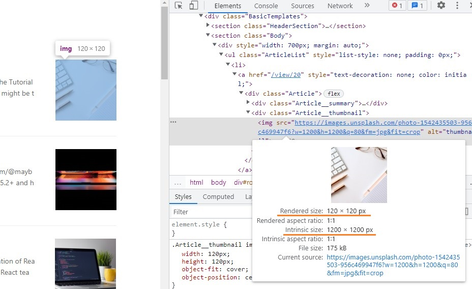

# 웹 성능 최적화 실습 1

정적 블로그 웹 페이지를 최적화하는 실습입니다.

강의를 보면서 알게된 내용에 대해서 정리했으며, 생략한 내용도 있습니다.

## 실습 내용

1. 로딩 성능 최적화

- 이미지 사이즈 최적화
- Code split
- 텍스트 압축

2. 렌더링 성능 최적화

- Bottleneck 코드 최적화

## 사용 툴

- Performance 패널을 이용한 분석
- Lighthouse 패널을 이용한 분석
  - OPPORTUNITIES : 로딩 성능에 대한 설명
  - DIAGNOSTICS: 렌더링 성능에 대한 설명
- Network 패널을 이용한 분석
- webpack-bundle-analyzer를 이용한 분석

## 성능 최적화 실습 시작!

[소스코드](https://github.com/performance-lecture/lecture-1)에서 소스를 clone한다.

해당 폴더 경로에서 터미널을 열고, npm i 명령어를 통해 노드 모듈들을 다운받는다.

노드 모듈 다운로드가 완료되면, 아래 명령어로 react app과 server를 실행시킨다. (따로 입력해야함)

```
// React app 실행
$ npm start 
// Server 실행
$ npm run server 
```

현재 실행된 웹 서비스의 상태를 진단하기 위해서, F12를 눌러 개발자 도구를 연다.

그리고 Lighthouse 탭을 누르면, 아래 사진과 같은 화면이 나온다.


왼쪽 상단에 있는 Analyze page load를 누르면 진단이 시작된다.

진단을 다 하고나면 아래 화면과 같이 나오는데, 현재 웹 서비스의 성능 점수는 47점이다.


아래로 내려보면 어떤 문제점을 개선해야 하는지 알려주는데, **OPPORTUNITIES**은 **로딩 성능**에 대한 설명이고 **DIAGNOSTICS**은 **렌더링 성능**에 대한 설명이다.

먼저 OPPORTUNITIES을 보면, 가장 문제가 심각해보이는 항목은 Properly size images이다. 즉 이미지 크기를 조정하라는 의미이다.


그렇다면, 이미지 사이즈 최적화부터 해보자!

### 이미지 사이즈 최적화

이미지 사이즈는 HTML 요소를 선택해서 확인해볼 수 있다. 



확인해보니, 화면에서 보이는 이미지는 '120px X 120px'밖에 안되는데 이미지 원본 사이즈는 '1200px X 1200px'이나 된다.

프론트엔드에서 이미지 사이즈를 최적화할 수 있는 방법이라기 보다는, 서버에서 프론트엔드에서 원하는 사이즈의 이미지를 보내주는 것이 맞다.

현재 이 웹 서비스에서는 Unsplash에서 이미지를 받아오고 있는데, 이미지를 받아올 때 작은 사이즈로 받아오도록 수정해보자.

Article 컴포넌트에서 이미지를 불러오고 있는데, 이때 getParametersForUnsplash 함수를 사용해서 가져올 이미지를 설정한다.

```
function getParametersForUnsplash({width, height, quality, format}) {
  return `?w=${width}&h=${height}&q=${quality}&fm=${format}&fit=crop`
}


```

width, height값이 1200으로 설정되어 있는 것만 수정하면 된다.

2배 정도 큰 이미지를 가져오는게 적절하다고 해서, 120px의 2배인 240px로 가져오도록 수정했다.

```

```

수정 후 다시 Lighthouse에서 성능 점검을 해보자.


Properly size images 항목이 사라진 것을 확인할 수 있다.

<!-- 

### Bottleneck 해결방안

- 특수 문자를 효율적으로 제거하기
  - replace 함수와 정규식 사용
  - remove-markdown 라이브러리 사용
- 작업하는 양 줄이기

### Bundle 파일 분석

### Code Splitting

코드를 분할하는 것

불필요한 코드 또는 중복되는 코드가 없이 적절한 사이즈의 코드가 적절한 타이밍에 로드될 수 있도록 하는 것

### 텍스트 압축

파일 크기가 2KB 이상인 경우에 압축을 하고, 미만인 경우 압축을 하지 않는게 더 효율적이다. (압축을 하고, 푸는데 시간이 걸리기 때문)

-->