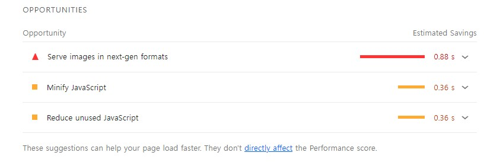
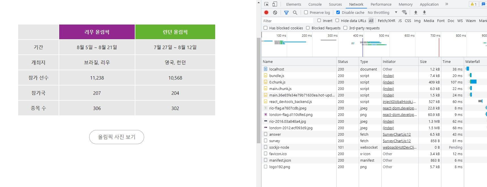
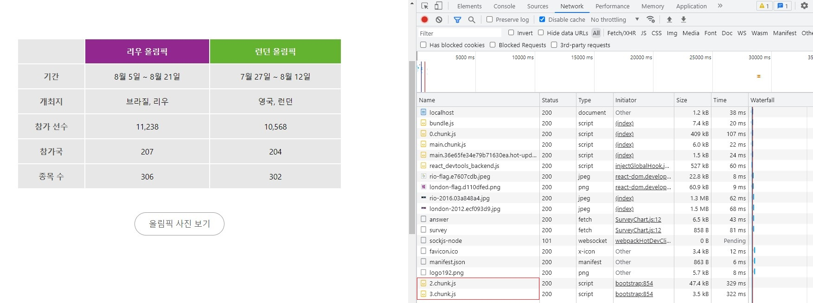

# 웹 성능 최적화 실습 2

올림픽에 대한 사진을 제공하고, 투표 기능이 있는 웹 페이지를 최적화하는 실습입니다.

강의를 보면서 알게된 내용에 대해서 정리했으며, 생략한 내용도 있습니다.

## 실습 내용

1. 렌더링 성능 최적화
  - 애니메이션 최적화 (Reflow, Repaint)

2. 로딩 최적화
  - 컴포넌트 Lazy loading (Code splitting)
  - 컴포넌트 Preloading
  - 이미지 Prefloading

## 사용 툴

- Performance 패널
- Lighthouse 패널
- Network 패널

## 성능 최적화 실습 시작!

[소스코드](https://github.com/performance-lecture/lecture-2)에서 소스를 clone한다.

해당 폴더 경로에서 터미널을 열고, npm i 명령어를 통해 노드 모듈들을 다운받는다.

노드 모듈 다운로드가 완료되면, 아래 명령어로 react app과 server를 실행시킨다. (따로 입력해야함)

> React app 실행
>> $ npm start 
> Server 실행
>> $ npm run server 

## 문제 찾기 (1)

사실,, 웹 브라우저 성능이 좋아져서 그런지 강의에서 제시한 애니메이션이 버벅이는 현상은 딱히 없었다.

이를 쟁크 현상이라고 하는데, 이 쟁크 현상을 해결하기 위해서는 브라우저 렌더링 과정에 대한 이해가 필요하다.

**브라우저 렌더링 과정**
> DOM + CSSDOM ⇒ Render Tree ⇒ Layout ⇒ Paint ⇒ Composite

브라우저는 변화된 내용을 인지하고, 다시 브라우저 렌더링 과정을 거친다.

애니메이션은 계속해서 변화가 일어나는데, 이를 짧은 시간안에 렌더링을 하려다보니 쟁크 현상이 발생한다고 한다.

이때, HTML 요소나 색상이 변경되면 Reflow와 Repaint가 발생한다.

HTML는 요소의 위치나 크기등이 변경되면 다시 렌더링을 하는데 이를 Reflow라고 한다. Reflow는 css에서 width, height 등의 영향을 받는다.

Repaint는 스타일이 변경되면 재렌더링되는 것을 말한다. Repaint는 color, background-color 등의 영향을 받으며, 브라우저 렌더링 과정에서 Layout를 건너뛰고 Paint를 한다.

### 애니메이션 최적화

Reflow와 Repaint를 피하기 위해서는 GPU의 도움을 받아야하는데, GPU는 transform, opacity등의 속성에 관여한다. GPU의 도움을 받으면 Layout, Paint 생략하게 된다.

차트를 직접 그리는 Bar 컴포넌트를 최적화해보자!

**Bar.js**
```
const BarGraph = styled.div`
  position: absolute;
  left: 0;
  top: 0;
  width: 100%;
  transform: scaleX(${({width}) => width / 100});
  transform-origin: 0;
  transition: transform 1.5s ease;
  height: 100%;
  background: ${({isSelected}) => isSelected ? 'rgba(126, 198, 81, 0.7)' : 'rgb(198, 198, 198)'};
  z-index: 1;
`
```

## 문제 찾기 (2)

이번에는 Lighthouse를 사용해서 성능 검사를 해보자.



OPPORTUNITIES를 확인해보면 아래 항목에 대한 최적화가 필요하다고 알려준다.

- Serve images in next-gen formats
- Minify JavaScript
- Reduce unused JavaScript

첫번째 문제점인 이미지 포맷을 변경하는 사항은 [웹 성능 최적화 실습 3]()에서 더 자세하게 다룰 예정이다.

Minify JavaScript은 현재 개발용이기 때문에 나오는 것이고, build를 하면 CRA에서 처리를 해준다. 

Reduce unused JavaScript는 [웹 성능 최적화 실습 1](https://github.com/ixio0330/TIL/tree/main/PerformanceOptimizatio/01.practice)에서도 다뤘던 내용인데, code splitting을 사용해 지연 로딩을 해서 해결할 수 있는 문제다.

Code splitting을 적용할 대상을 생각해보면, 올림픽 사진 보기 버튼을 눌렀을 때 나오는 모달에 적용할 수 있을 것 같다.

### Code Splitting

App.js에서 '올림픽 사진 보기' 버튼을 클릭했을 때 ImageModal 파일을 로드하도록 수정했다.

**App.js**

```
import React, { useState, lazy, Suspense } from 'react'
const ImageModal = lazy(() => import('./components/ImageModal'));

function App() {
  const [showModal, setShowModal] = useState(false)
  return (
    <div className="App">
      <Header />
      <InfoTable />
      <ButtonModal onClick={() => setShowModal(true)}>올림픽 사진 보기</ButtonModal>
      <SurveyChart />
      <Footer />
      <Suspense fallback={null}>
        {showModal ? <ImageModal closeModal={() => setShowModal(false)} /> : null}
      </Suspense>
    </div>
  )
}
```

Code splitting을 했더니, 오히려 모달창이 완벽하게 보이기까지 오래 걸려서 모달창이 깨져보이는 단점이 생겼다.

이렇게 code splitting은 장점만을 가지고 있는 것은 아니다. 

그렇다면 컴포넌트를 보여주기 전에 미리 로드해놓으면 모달창이 깨지지 않게 보여줄 수 있을 것 같은데, 이렇게 미리 로드하는 것을 preload라고 한다.

### Preload

모달 컴포넌트를 Preload를 할 시점을 두 가지로 생각해볼 수 있다.

1. 사용자가 버튼 위에 마우스를 올려 놨을 때
2. 최초 페이지 로드가 되고, 모든 컴포넌트의 마운트가 끝났을 때

우선 버튼 위에 마우스를 올려놨을 때 모달 컴포넌트를 불러오도록 해보자.

#### 사용자가 버튼 위에 마우스를 올려 놨을 때

```
function App() {
  const [showModal, setShowModal] = useState(false)
  const preload = () => {
    const Component = import('./components/ImageModal');
  }
  return (
    <div className="App">
      <Header />
      <InfoTable />
      <ButtonModal onClick={() => setShowModal(true)} onMouseEnter={preload} >올림픽 사진 보기</ButtonModal>
      <SurveyChart />
      <Footer />
      <Suspense fallback={null}>
        {showModal ? <ImageModal closeModal={() => setShowModal(false)} /> : null}
      </Suspense>
    </div>
  )
}
```

마우스를 올렸을 때 컴포넌트가 불러와지는 것을 확인하기 위해서는 Network탭을 사용해야 한다.

마우스를 버튼에 올리기 전에 요청해서 받은 파일 목록이다.



마우스를 버튼에 올리고 확인해보면 2.chunk.js, 3.chunk.js를 요청해서 받아온 것을 확인해볼 수 있다.



#### 최초 페이지 로드가 되고, 모든 컴포넌트의 마운트가 끝났을 때

이번에는 모든 컴포넌트가 마운트 되었을 때, 모달 컴포넌트를 로드해보자.

Lazy 로딩을 하고 preload를 할 수 있도록 컴포넌트를 반환하는 lazyWithPreload 함수를 만들어서 사용했다.

```
function lazyWithPreload(importFunction) {
  const Component = lazy(importFunction);
  Component.preload = importFunction;
  return Component;
}

const LazyImageModal = lazyWithPreload(() => import('./components/ImageModal'));

function App() {
  const [showModal, setShowModal] = useState(false)
  useEffect(() => {
    LazyImageModal.preload();
  }, [])
  return (
    <div className="App">
      <Header />
      <InfoTable />
      <ButtonModal onClick={() => setShowModal(true)} >올림픽 사진 보기</ButtonModal>
      <SurveyChart />
      <Footer />
      <Suspense fallback={null}>
        {showModal ? <LazyImageModal closeModal={() => setShowModal(false)} /> : null}
      </Suspense>
    </div>
  )
}
```

함수 컴포넌트를 사용했기 때문에, useEffect를 사용해서 모든 컴포넌트가 마운트 되었을 때, 모달 컴포넌트를 로드한다.

Network 탭을 확인해보면 모든 컴포넌트가 마운트되면 알아서 로드를 해준다.

#### Image 인스턴스 사용해서 이미지 preload

모달 컴포넌트에서 가장 먼저 보이는 첫번째 이미지가 있다. 이 이미지를 먼저 로드해놓으면, 모달 창이 깨지는 것을 방지할 수 있다.

Image 클래스로 인스턴스를 생성해서, 해당 인스턴스의 src에 처음 로드할 이미지 파일 경로를 넣어주면 된다.

```
useEffect(() => {
  LazyImageModal.preload();
  const firstImage = new Image();
  firstImage.src = 'https://stillmed.olympic.org/media/Photos/2016/08/20/part-1/20-08-2016-Football-Men-01.jpg?interpolation=lanczos-none&resize=*:800';
}, [])
```

Network 탭을 확인해보면 해당 이미지가 로드되는 것을 알 수 있다.
